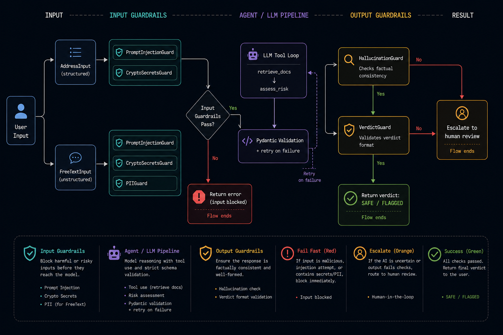

# AI Evaluation Framework

A transaction-safety agent that implements AI testing and evaluation approaches for LLM agent and RAG workflows.



## Table of contents

- [Background](#background)
- [Technology](#technology)
- [Testing approach](#testing-approach)
- [Project structure](#project-structure)
- [Setup](#setup)
- [Configuration](#configuration)
- [Running the agent](#running-the-agent)
- [Test strategy](#test-strategy)
- [Runtime guardrails](#runtime-guardrails)
- [Evaluation](#evaluation)
- [TODO](#todo)

---

### Background

This project is a proof of concept (PoC) for testing and evaluating LLM-powered agents with tools like DeepEval, OpenAI, ChromaDB, Pydantic, Presidio, and GitHub Actions. The `transaction_safety` agent is the reference implementation. It:

- Takes a blockchain address or free-text safety question
- Validates input with Pydantic
- Checks input guardrails (prompt injection, PII, crypto secrets)
- Calls tools and uses RAG to retrieve blockchain safety context
- Returns a structured safety verdict validated with Pydantic
- Runs output guardrails (hallucination detection, verdict validation)

If the final LLM response is malformed JSON or does not match the expected Pydantic output schema, the agent retries validation automatically.

---

### Technology

- **Language:** Python
- **LLM:** OpenAI (GPT-4o-mini by default)
- **Structured validation:** Pydantic
- **RAG:** LangChain, OpenAI embeddings, ChromaDB
- **PII detection:** Microsoft Presidio, spaCy
- **Hallucination guard:** Hugging Face Transformers, PyTorch, NLI model
- **Test runner:** pytest, pytest-cov, pytest-json-report
- **Evaluation:** DeepEval, scikit-learn
- **CI/CD:** GitHub Actions workflows for CI and evaluation

---

### Testing approach

- Unit tests cover deterministic internals: Pydantic models, structured output validation, retry parsing, tools, risk-pattern scanning, and runtime guardrails
- Integration tests verify that the real agent wiring works through `TransactionSafetyAgent.run()`: `tests/transaction_safety/integration/`
- End-to-end evaluation treats the full agent as a black box and scores final behaviour against golden cases: `tests/transaction_safety/evaluation/e2e/`
- Component-level RAG evaluation checks retrieval and grounding quality directly: `tests/transaction_safety/evaluation/component/rag/`

All test layers are integrated into GitHub Actions. Unit tests, including guardrail component tests, run on every push and PR without an API key. Integration tests, end-to-end evaluation, and component-level RAG evaluation run from the manual evaluation workflow.

---

## Project structure

<details>
<summary>Expand project tree</summary>

```txt
ai_evaluation_framework/
├── agents/
│   └── transaction_safety/        # reference agent implementation
│       └── guardrails/            # runtime guardrails used by the agent
│           ├── input/
│           └── output/
├── data/
│   └── docs/                      # RAG source docs
├── datasets/
│   └── transaction_safety/        # golden datasets
├── docs/                          # diagrams and README assets
├── scripts/                       # helper scripts
├── tests/
│   └── transaction_safety/
│       ├── unit/
│       │   ├── test_agent_safety.py
│       │   ├── test_pydantic_output_validator.py
│       │   ├── test_pydantic_models.py
│       │   ├── test_tools.py
│       │   └── guardrails/
│       │       ├── input/
│       │       │   ├── test_crypto_secrets.py
│       │       │   └── test_prompt_injection.py
│       │       └── output/
│       │           ├── test_hallucination.py
│       │           └── test_verdict.py
│       ├── integration/
│       │   └── test_agent_flow.py
│       └── evaluation/
│           ├── e2e/
│           │   ├── test_final_answer_quality.py
│           │   └── test_risk_classification.py
│           ├── component/
│           │   └── rag/
│           │       ├── test_rag_quality.py
│           │       └── test_rag_batch_evaluate.py
│           └── synthetic/         # manual DeepEval synthetic golden generators
├── README.md
├── pytest.ini
└── requirements.txt
```

</details>

---

## Setup

```bash
python3 -m venv venv           # Windows: py -m venv venv
source venv/bin/activate       # Windows: venv\Scripts\activate
pip install -r requirements.txt
cp .env.example .env           # fill in OPENAI_API_KEY
```

---

## Configuration

All configuration is in `.env`. The agent reads it automatically via `python-dotenv`.

- `OPENAI_API_KEY` — required
- `DEFAULT_MODEL` — defaults to `gpt-4o-mini`
- `DEFAULT_TEMPERATURE` — defaults to `0` for more repeatable eval runs
- `DEFAULT_N_RETRY` — defaults to `5` retry attempts for Pydantic validation failures

---

## Running the agent

```bash
source venv/bin/activate
python -m run
```

---

## Test strategy

Tests are split by scope, cost, and whether they exercise the whole agent or a specific component.

| Scope | Folder | API key | Speed | Layer | What it covers |
|---|---|---|---|---|---|
| Unit tests | `tests/transaction_safety/unit/` | No | Fast | Unit + guardrail components | Pydantic models, structured output validation, retry parsing, tool routing, prompt building, prompt injection, PII, private keys/seed phrases, hallucination guard, verdict guard |
| Integration smoke test | `tests/transaction_safety/integration/` | Yes | Slow | Component wiring | One minimal `TransactionSafetyAgent.run()` check that verifies the real agent path can return a structured result |
| End-to-end evaluation | `tests/transaction_safety/evaluation/e2e/` | Yes | Slow | Full-agent quality evaluation | Golden-case verdict checks, verdict metrics, and LLM-as-a-judge scoring over full agent outputs |
| Component-level RAG evaluation | `tests/transaction_safety/evaluation/component/rag/` | Yes | Slow | RAG component evaluation | Retrieval relevance, contextual precision/recall, and RAG answer grounding/relevancy |

### Commands

```bash
# lint only — no API key
ruff check .

# run all pre-commit checks locally
pre-commit run --all-files

# install git hooks so checks run before each commit
pre-commit install

# unit only — no API key, runs in CI on every commit
pytest tests/transaction_safety/unit/

# integration — requires OPENAI_API_KEY
pytest tests/transaction_safety/integration/ -v

# unit + guardrail component tests + coverage report
pytest tests/transaction_safety/unit/ \
  --cov=agents/transaction_safety --cov-report=term-missing

# skip slow/API tests
pytest -m "not integration and not evaluation"

# run by marker
pytest -m integration
pytest -m evaluation
pytest -m guardrails  # guardrail component tests inside unit/
```

---

## Logging

Logs are written to both stdout and a timestamped file in `logs/` by default.

| Variable | Default | Description |
|---|---|---|
| `LOG_LEVEL` | `INFO` | `DEBUG`, `INFO`, `WARNING`, or `ERROR` |
| `LOG_DIR` | `logs/` | directory for log files; each run creates `agent_YYYYMMDD_HHMMSS.log` |

Set `LOG_LEVEL=DEBUG` to see full LLM prompts and responses.

---

## Runtime guardrails

The agent implements runtime guardrails for both input and output safety. Input guardrails block prompt injection attempts, PII, private keys, and seed phrases before the LLM is called. Output guardrails validate the final verdict and check the agent's reasoning for contradictions against retrieved context.

Input guards return `(None, error_message)` before any model call. Output and tool-loop failures return an `ESCALATE` result so callers still receive structured output.

### Input guards (run before the LLM call)

| Guard | Location | What it catches |
|---|---|---|
| `PromptInjectionGuard` | `agents/transaction_safety/guardrails/input/` | "ignore instructions", "you are now", `<system>` tags, jailbreak patterns |
| `PIIGuard` | `agents/transaction_safety/guardrails/input/` | Names, emails, phones, SSN, IBAN — uses Microsoft Presidio |
| `CryptoSecretsGuard` | `agents/transaction_safety/guardrails/input/` | Ethereum/WIF/Solana private keys (regex), BIP-39 seed phrases (12/15/18/21/24 consecutive words) |

### Output guards (run after structured output is validated)

| Guard | Location | What it checks |
|---|---|---|
| `HallucinationGuard` | `agents/transaction_safety/guardrails/output/` | Detects contradictions between LLM output and retrieved docs using NLI (contradiction score threshold) |
| `VerdictGuard` | `agents/transaction_safety/guardrails/output/` | FLAGGED risk factor descriptions must be non-trivial; FLAGGED confidence must be ≥ 0.4 |

### Setup

Presidio requires a spaCy language model. Run once after `pip install`:

```bash
python -m spacy download en_core_web_sm
```

Every guard has one method: `check(text_or_result) -> GuardResult(passed, error)`.

---

## Evaluation

The evaluation layer measures agent quality outside the runtime request path. It includes end-to-end checks against golden inputs and expected outcomes, plus component-level RAG checks for retrieval relevance, grounding, and context quality.

### Metrics At A Glance

The project uses two evaluation styles: code-based metrics for verdict classification, and DeepEval metrics for reasoning, grounding, hallucination, tool use, and RAG quality. These evals call the agent, retriever, or judge model, so they require `OPENAI_API_KEY`.

| Metric | What it measures | Type | Best evaluated at |
|---|---|---|---|
| Accuracy | How often the final verdict matches the golden verdict | deterministic, scikit-learn | End-to-end |
| Recall | Of all expected `FLAGGED` inputs, how many were caught | deterministic, scikit-learn | End-to-end |
| F1 | Balance between catching risky inputs and avoiding noisy predictions | deterministic, scikit-learn | End-to-end |
| ROC-AUC | How well confidence scores separate safe vs. risky cases across thresholds | deterministic, scikit-learn | End-to-end |
| High-confidence missed scam check | Fails if an expected `FLAGGED` case is predicted `SAFE` with high confidence | deterministic, pytest | End-to-end |
| Faithfulness | Whether the final reasoning is grounded in retrieved context | LLM judge, DeepEval | End-to-end and RAG generation |
| Answer relevancy | Whether the answer addresses the user's safety question | LLM judge, DeepEval | End-to-end and RAG generation |
| Hallucination | Whether the answer invents or contradicts facts | LLM judge, DeepEval | End-to-end |
| Tool correctness | Whether the agent called expected tools such as `retrieve_docs` and `assess_risk` | deterministic, DeepEval | End-to-end trajectory |
| Contextual relevancy | Whether retrieved chunks are relevant to the query | LLM judge, DeepEval | Component-level RAG |
| Contextual precision | Whether retrieved chunks are useful rather than noisy | LLM judge, DeepEval | Component-level RAG |
| Contextual recall | Whether retrieval surfaces enough context to support the expected answer | LLM judge, DeepEval | Component-level RAG |
| G-Eval | Custom natural-language criteria, such as address-format/chain consistency | LLM judge, DeepEval | End-to-end or component-level |

The agent exposes a lightweight `tool_trace` for evaluation only. It records tool name, input parameters, and output so DeepEval can compare `tools_called` against `expected_tools` without adding trace data to the user-facing verdict.

G-Eval example for this agent:
```python
from deepeval.test_case import SingleTurnParams

GEval(
    name="Format-Chain Consistency",
    evaluation_steps=[
        "Check if the reasoning identifies the address as Solana format",
        "Check if the reasoning explains why a Solana address is incompatible with Ethereum",
        "Check that the verdict reflects this format-chain mismatch as a risk",
    ],
    evaluation_params=[
        SingleTurnParams.INPUT,
        SingleTurnParams.ACTUAL_OUTPUT,
        SingleTurnParams.RETRIEVAL_CONTEXT,
    ],
)
```

Optional: save pytest results for DeepEval evals as JSON:

Component-level RAG eval:

```bash
pytest tests/transaction_safety/evaluation/component/rag/test_rag_quality.py -v \
  --json-report --json-report-file=evaluation_results/deepeval/rag_component.json
```

End-to-end final-answer eval:

```bash
pytest tests/transaction_safety/evaluation/e2e/test_final_answer_quality.py -v \
  --json-report --json-report-file=evaluation_results/deepeval/final_answer_e2e.json
```

Windows:

```bash
pytest tests\transaction_safety\evaluation\component\rag\test_rag_quality.py -v ^
  --json-report --json-report-file=evaluation_results\deepeval\rag_component.json

pytest tests\transaction_safety\evaluation\e2e\test_final_answer_quality.py -v ^
  --json-report --json-report-file=evaluation_results\deepeval\final_answer_e2e.json
```

### Batch eval with caching

Most eval tests use `assert_test(...)` for simple pytest assertions. The RAG batch template uses DeepEval `evaluate(...)` directly to show cache and batch-result handling.

This pattern is useful when the golden set grows large. If a long evaluation run fails near the end, cached metric results can avoid rerunning every successful case. DeepEval provides this through `CacheConfig`, so the framework does not need custom caching logic.

```bash
pytest tests/transaction_safety/evaluation/component/rag/test_rag_batch_evaluate.py -v
```

### Golden set

Eval types require golden sets: curated inputs with expected verdicts, expected outputs, or metadata needed to build test cases at runtime. Verdict goldens live in the end-to-end evaluation tests, especially `tests/transaction_safety/evaluation/e2e/test_risk_classification.py`.

RAG eval goldens are stored as JSON:

```txt
datasets/transaction_safety/rag_retrieval_goldens.json
datasets/transaction_safety/rag_generation_goldens.json
```

`component/rag/test_rag_quality.py` loads those files into DeepEval `EvaluationDataset` objects, converts each `Golden` into an `LLMTestCase` during pytest, and fills dynamic fields such as `retrieval_context` and `actual_output` from the current retriever/agent run.

### Synthetic goldens

Manual utilities for generating candidate synthetic goldens live in:

```txt
tests/transaction_safety/evaluation/synthetic/
```

They show three DeepEval synthesizer patterns: from docs, from fixed contexts, and from existing goldens. Generated rows are saved under `datasets/transaction_safety/synthetic/` and should be reviewed before being copied into the real eval datasets.

Run them manually:

```bash
python tests/transaction_safety/evaluation/synthetic/from_docs.py
python tests/transaction_safety/evaluation/synthetic/from_contexts.py
python tests/transaction_safety/evaluation/synthetic/from_existing_goldens.py
```

These commands call DeepEval's synthesizer and may use paid LLM calls. They are not part of CI.

---

## TODO

- Expand the golden set in `e2e/test_risk_classification.py` as the agent handles more edge cases
- Add confusion matrix logging to the E2E verdict metrics output
- Add Phoenix tracing with spans for `agent.run()`, retrieval, tool calls, LLM calls, and guardrail checks
- Record optional `token_cost` and `completion_time` metadata once the LLM adapter exposes usage and timing data
- Add simple prompt/model metadata to eval reports, such as `agent`, `model`, and `prompt_version`, before considering DeepEval prompt management
